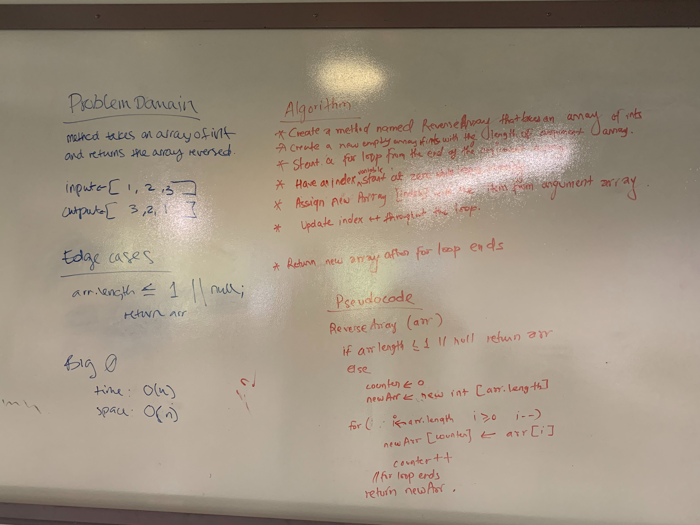

# Reverse an Array

## Challenge
Write a function called reverseArray which takes an array as an argument. Without utilizing any of the built-in methods available to your language, return an array with elements in reversed order.

## Approach & Efficiency
<!-- What approach did you take? Why? What is the Big O space/time for this approach? -->
The initial approach taken in pair whiteboarding is to do a reverse for loop and add each element of the origin array to the new array starting at index 0.
The Big 0 space/time for this is 0(n).

For the stretch goal of another solution, I instantiated an index variable and a temp variable to swap elements. The time complexity is still 0(n) but the space complexity is 0(1).

## Solution
* 