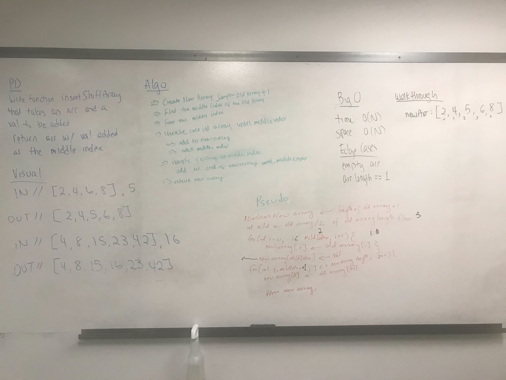

# Insert and shift an array at the middle index

## Challenge
Write a function called insertShiftArray which takes in an array and the value to be added. Without utilizing any of the built-in methods available to your language, return an array with the new value added at the middle index.

## Approach & Efficiency
First finding the middle index of the input array and inputting everything from the left side of the middle index into the new array, inputting the value argument as the middle index of the new array and then inputting the rest of the input array into the new array. Big 0 space/time is 0(n).

## Solution
* 