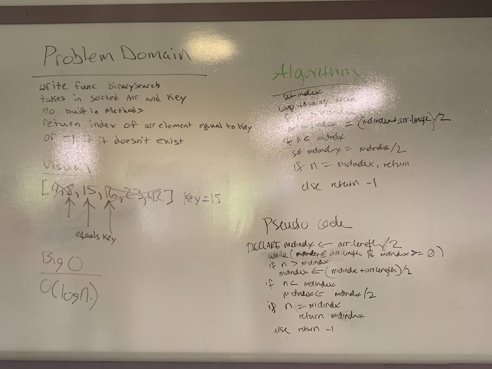

# Binary Search

## Challenge
Write a function called BinarySearch which takes in 2 parameters: a sorted array and the search key. Without utilizing any of the built-in methods available to your language, return the index of the array’s element that is equal to the search key, or -1 if the element does not exist.

## Approach & Efficiency
First find the middle point of the sorted array. Check to see if the array at the middle index is equal to the target, if so, return, if the middle point is higher than the target, set the new middle index to be inbetween the old middle index and the end of the sorted array. If the target is lower than the value at the middle index, find the midpoint between the target and the beginning of the array. Do these steps until you find the target. This is O(log n).

## Solution

[Link to code](../code401challenges/src/main/java/code401challenges/BinarySearch.java)

[Link to tests](../code401challenges/src/test/java/code401challenges/BinarySearchTest.java)

* 