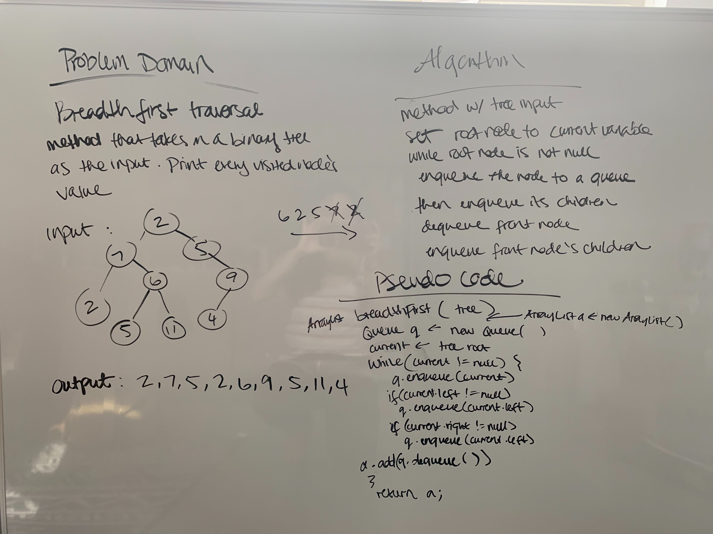

# Breadth First Traversal

## Challenge
Write a breadth first traversal method which takes a Binary Tree as its unique input. Without utilizing any of the built-in methods available to your language, traverse the input tree using a Breadth-first approach; print every visited node’s value.

## Approach & Efficiency
I used a Queue to store node values to then add to an arraylist. Enqueue-ing the current node, it's children nodes and then dequeueing the first node in the queue. This allows me to then have the current node as the next front node and add it's children to the queue. Dequeueing as children nodes are added to the queue and adding them to the arraylist to be printed out. Time and space complexity of O(n).

## Solution

* [Breadth First Code](../Data-Structures/src/main/java/tree)
* [Breadth First Tests](../Data-Structures/src/test/java/tree)

* 