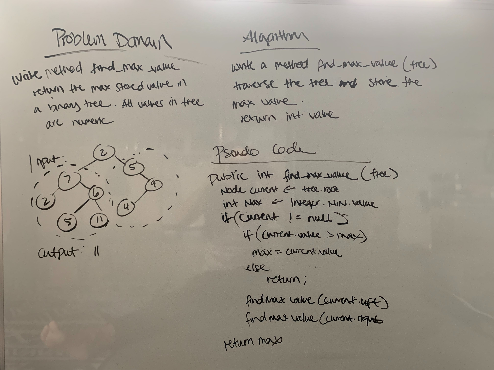

# Find Maximum Value in a Binary Tree

## Challenge
Write an instance method called find-maximum-value. Without utilizing any of the built-in methods available to your language, return the maximum value stored in the tree. You can assume that the values stored in the Binary Tree will be numeric.

## Approach & Efficiency
Set the current max to -1, if the tree is empty, return -1. If not empty, max is equal to the root value. Using recursion, I am resetting the max value when traversing through the left and right nodes and then returning the max value. Time and space complexity of O(n).

## API

* [Find Max Value Code](../Data-Structures/src/main/java/tree)
* [Find Max Value Tests](../Data-Structures/src/test/java/tree)

* 