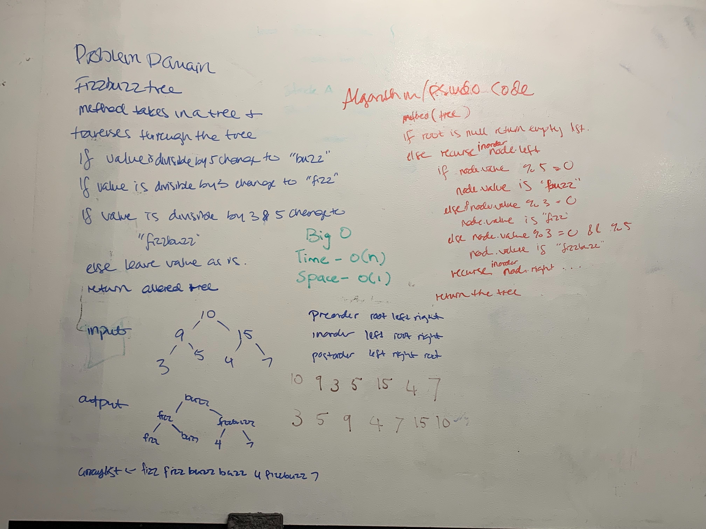

# FizzBuzz tree

## Challenge
* Write a function called FizzBuzzTree which takes a tree as an argument.
* Without utilizing any of the built-in methods available to your language, determine weather or not the value of each node is divisible by 3, 5 or both, and change the value of each of the nodes:
* If the value is divisible by 3, replace the value with “Fizz”
* If the value is divisible by 5, replace the value with “Buzz”
* If the value is divisible by 3 and 5, replace the value with “FizzBuzz”
* Return the tree with its new values.

## Approach & Efficiency
Approach is to write out the regular fizzbuzz conditionals and provide a starting node as root. Then worked through the tree using recursion to change the values. This has a time complexity of O(n) and space of O(1).

## API
* fizzBuzzTree()
* fizzBuzz()

* [FizzBuzz Tree Code](../Data-Structures/src/main/java/tree)
* [FizzBuzz Tree Tests](../Data-Structures/src/test/java/tree)

* 