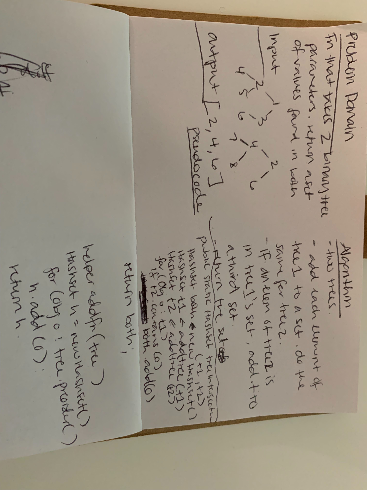

# Hash Tables
Implement a Hashtable

## HashTable.java
* add: takes in both the key and value. This method should hash the key, and add the key and value pair to the table, handling collisions as needed.
* get: takes in the key and returns the value from the table.
* contains: takes in the key and returns a boolean, indicating if the key exists in the table already.
* hash: takes in an arbitrary key and returns an index in the collection.

## RepeatedWord.java
* Write a function that accepts a lengthy string parameter.
* Without utilizing any of the built-in library methods available to your language, return the first word to occur more than once in that provided string.
* 

## TreeIntersection.java
* Write a function called tree_intersection that takes two binary tree parameters.
* Without utilizing any of the built-in library methods available to your language, return a set of values found in both trees.
* 

## API
* hash()
* add()
* get()
* contains()
* repeatedWord()
* treeIntersection()

* [Hashtable](../Data-Structures/src/main/java/hashtable)
* [Hashtable Tests](../Data-Structures/src/test/java/hashtable)

