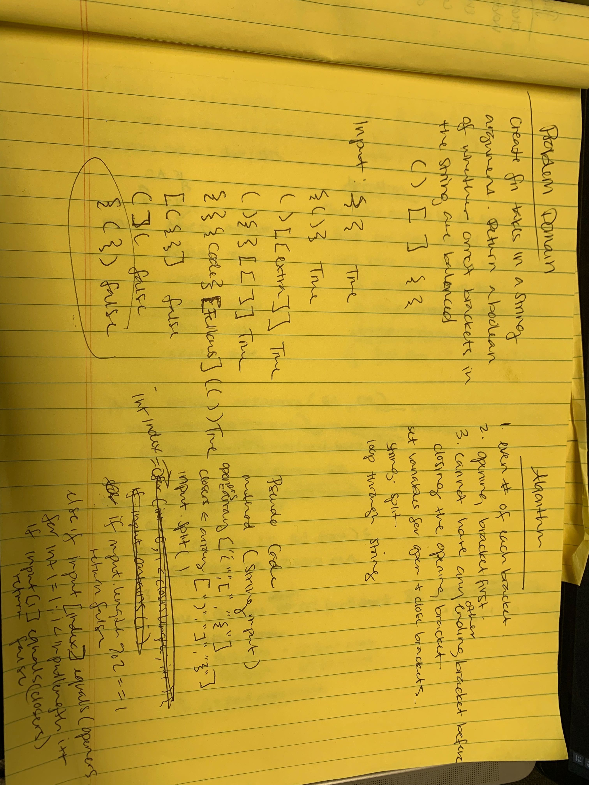

# Multi Bracket Validation

## Features
Your function should take a string as its only argument, and should return a boolean representing whether or not the brackets in the string are balanced. There are 3 types of brackets:

Round Brackets : ()
Square Brackets : []
Curly Brackets : {}

## Approach & Efficiency
<!-- These methods are all Big O(1) for space and time because we are just adding one node at a time or removing one node at a time. Approach was to reassign properties to the nodes so that it makes sense. (For stacks, reassigning the top node property. For queues, reassigning the front and rear node properties.) -->

## API
...

* [Multi Bracket Validation Code](../Data-Structures/src/main/java/utilities)
* [Multi Bracket Validation  Tests](../Data-Structures/src/test/java/utilities)

* 