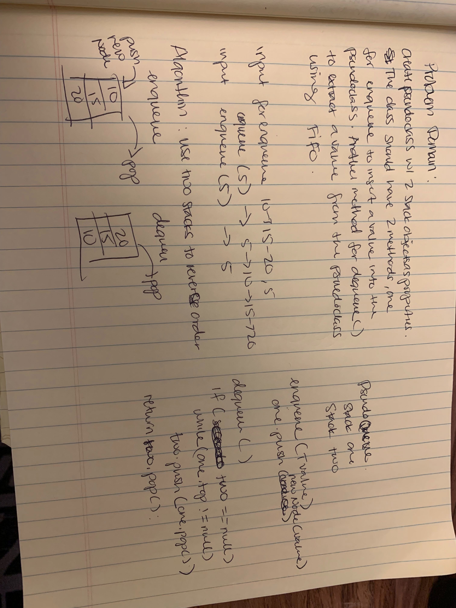

# PseudoQueue
Implement a Queue using two Stacks.

## Challenge
Create a brand new PseudoQueue class. Do not use an existing Queue. Instead, this PseudoQueue class will implement our standard queue interface (the two methods listed below), but will internally only utilize 2 Stack objects. Ensure that you create your class with the following methods:

enqueue(value) which inserts value into the PseudoQueue, using a first-in, first-out approach.
dequeue() which extracts a value from the PseudoQueue, using a first-in, first-out approach.
The Stack instances have only push, pop, and peek methods. You should use your own Stack implementation. Instantiate these Stack objects in your PseudoQueue constructor.

## Approach & Efficiency
My approach was two use the first stack for the enqueue method to add new nodes to. Then when it was time to dequeue, the nodes from the first stack would get popped off and pushed into the new stack. Creating a FIFO flow upon dequeue. My method for adding a node to the queue(enqueue) has a Big O time/space complexity of O(1), however my dequeue method has a time of O(n) and space of O(1).

## API
* enqueue()
* dequeue()

* [Pseudo Queue](../Data-Structures/src/main/java/pseudoqueue)
* [Pseudo Queue Tests](../Data-Structures/src/test/java/pseudoqueue)

* 
